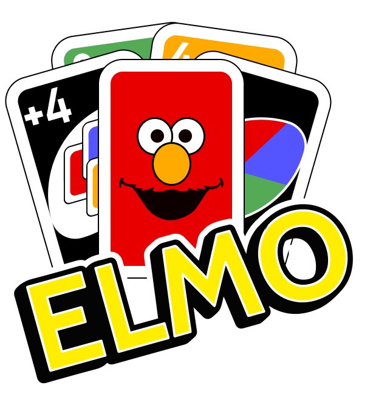
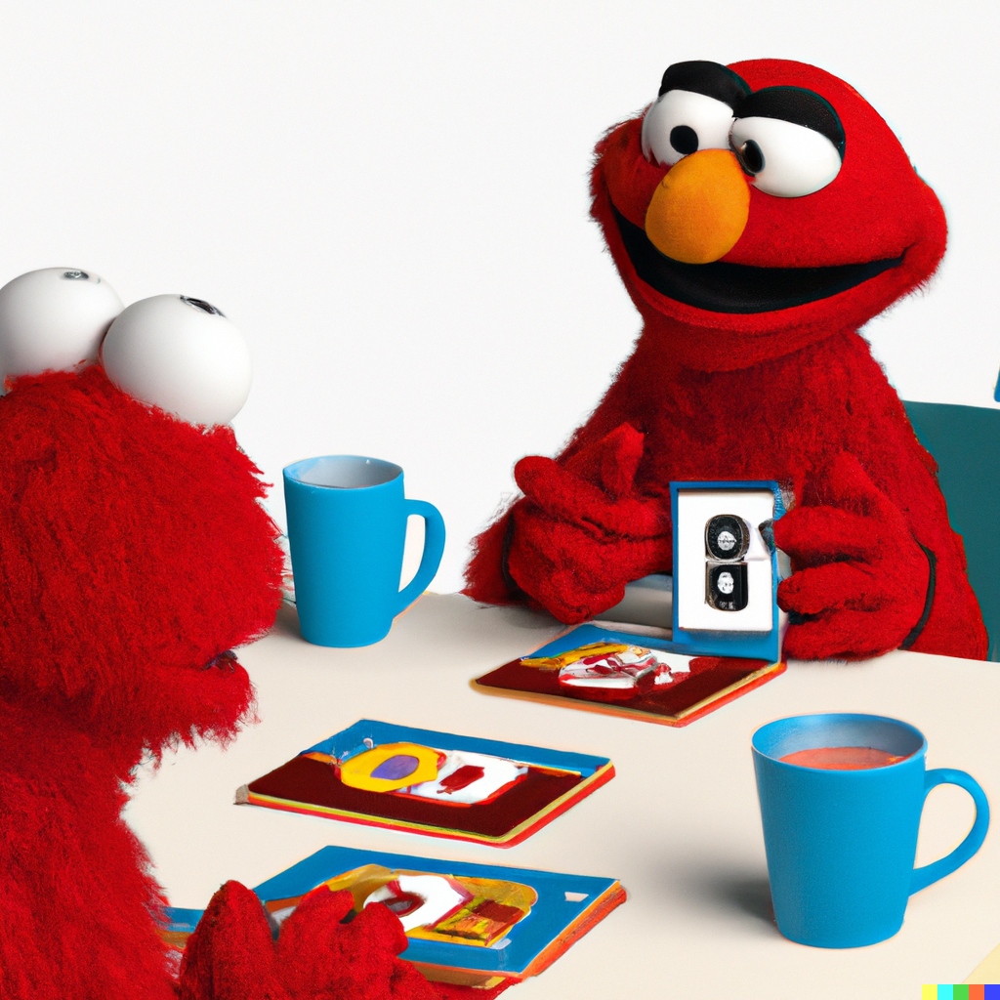

# PLM-ElmO-Game

> By Nicolas Crausaz & Maxime Scharwath

## ElmO

ElmO is a game based on the famous UNO game. It is written in Elm. It was developed as part of the course Programming Language Multiverse 2023 (HEIG-VD).



<button style="display: block; margin: 0 auto"><a href="https://elmo.vercel.app/">Play now !</a ></button>

## Run the project

You can run the project locally following these steps:

<small>You need to have npm installed on your computer.</small>

Install the dependencies:
```bash
npm install
```

Run the project:
```bash
npm run dev
```

Have fun !

